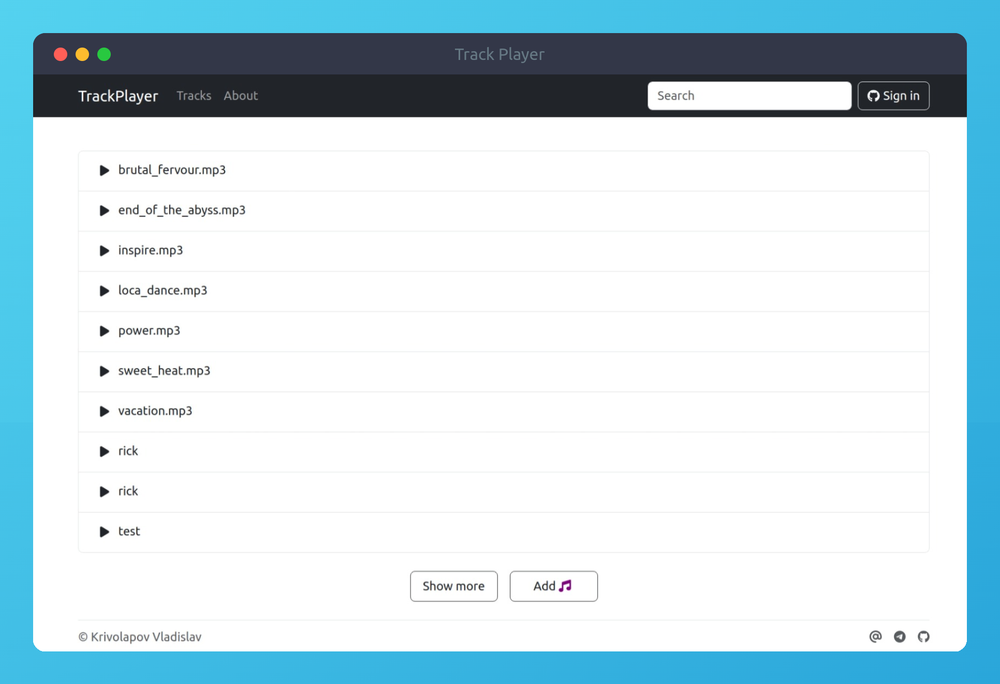

<div align="center">

# Track Player

Audio streaming service

[Installation](#installation) •
[Built With](#built-with) •
[License](#license)




</div>

## Installation

1. Install **[Docker](https://www.docker.com/)**
2. Clone this repository
    ```bash
    git clone https://github.com/nell-shark/spring-boot-react-track-player
    ```
3. Set your environment variables in ```docker-compose.yml```:
   ```yaml
   environment:
      - YOUR_GITHUB_CLIENT_ID=
      - YOUR_GITHUB_CLIENT_SECRET=
      - YOUR_AWS_S3_BUCKETS_TRACKS=
      - YOUR_AWS_CREDENTIALS_ACCESS_KEY=
      - YOUR_AWS_CREDENTIALS_SECRET_KEY=
    ```
4. Run all containers with:
   ```bash
    docker-compose up
    ```
5. Go to **[localhost:3000](http://localhost:3000)**

## Built With

<p align="center">
  <a href="https://www.docker.com/">
    
  </a>
  <a href="https://spring.io/">
    
  </a>
  <a href="https://aws.amazon.com/">
    
  </a>
  <a href="https://getbootstrap.com/">
    
  </a>
  <a href="https://java.com/">
    
  </a>
  <a href="https://www.mysql.com/">
    
  </a>
  <a href="https://react.dev/">
    
  </a>
  <a href="https://www.mysql.com/">
    
  </a>
  <a href="https://redux.js.org/">
    
  </a>
  <a href="https://www.typescriptlang.org/">
    
  </a>
  <a href="https://gradle.org/">
    
  </a>
  <a href="https://github.com/nell-shark/spring-boot-react-track-player/actions">
    
  </a>
</p>

## License

Code released under the [MIT](https://choosealicense.com/licenses/mit/) license

